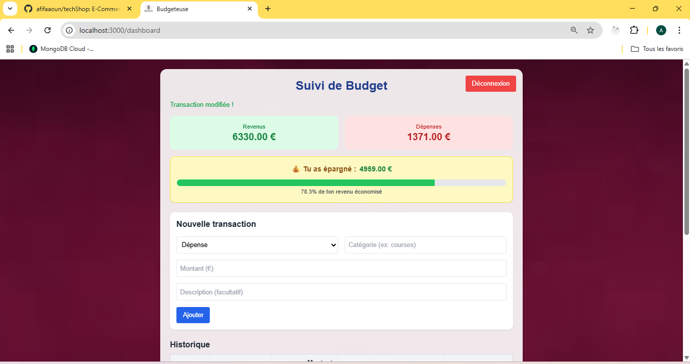

# 💸 Budgeteuse - Application de gestion de budget (MERN)

Budgeteuse est une application web full-stack permettant aux utilisateurs de suivre leurs revenus et dépenses, de visualiser leurs transactions par catégorie, et de mieux gérer leur budget personnel.

---

## 🚀 Fonctions principales

- Authentification sécurisée (inscription / connexion)
- Ajout, modification et suppression de transactions
- Catégorisation des revenus et dépenses
- Vue tableau de bord avec résumé financier
- Interface utilisateur responsive (mobile & desktop)

---

## 🛠️ Stack technique

- **Frontend** : React, Tailwind CSS, React Router
- **Backend** : Node.js, Express.js
- **Base de données** : MongoDB + Mongoose
- **Authentification** : JWT + middleware
- **API REST sécurisée**

---

## 📁 Structure du projet

=======
Excellent 🌟 ! Une application **MERN de gestion de budget** (calcul des dépenses et revenus) est un super projet à montrer sur GitHub.
Voici un **README.md prêt à l’emploi**, bien structuré et professionnel 👇

---

````markdown
# 💰 budgeteuse — Application de gestion de budget (MERN)

budgeteuse est une application MERN qui permet de **gérer ses revenus et dépenses** facilement.  
Elle aide l’utilisateur à suivre ses finances personnelles, visualiser son solde disponible et analyser ses habitudes de dépense grâce à une interface claire et intuitive.

---

## 🚀 Technologies utilisées

- **MongoDB** — Base de données NoSQL pour stocker les transactions
- **Express.js** — Framework backend pour créer les routes API
- **React.js** — Interface utilisateur dynamique et réactive
- **Node.js** — Environnement d’exécution côté serveur

---

## ⚙️ Installation et lancement

### 1️⃣ Cloner le projet

```bash
git clone https://github.com/afifaaoun/budgeteuse.git
```
````

### 2️⃣ Accéder au dossier

```bash
cd budgeteuse
```

### 3️⃣ Installer les dépendances backend

```bash
cd backend
npm install
```

### 4️⃣ Installer les dépendances frontend

```bash
cd ../frontend
npm install
```

### 5️⃣ Lancer l’application

- Démarrer le **backend**

  ```bash
  npm run server
  ```

- Démarrer le **frontend**

  ```bash
  npm start
  ```

---

## 📊 Fonctionnalités principales

✅ Ajouter des **revenus et dépenses**
✅ Calcul automatique du **solde total**
✅ Visualisation des **dépenses par catégorie**
✅ Suppression et modification des transactions
✅ Interface responsive et moderne
✅ Connexion sécurisée avec **MongoDB Atlas**

---

## 🧠 Architecture du projet

```
budgeteuse/
│
├── backend/
│   ├── models/
│   ├── routes/
│   ├── controllers/
│   ├── server.js
│
├── frontend/
│   ├── src/
│   │   ├── components/
│   │   ├── pages/
│   │   ├── services/
│   │   ├── App.js
│
├── .env
├── package.json
└── README.md
```

---

## 📸 Aperçu



---

## 👩‍💻 Développeuse

**Afifa — Full Stack Developer (MERN)**
[💼 Mon profil GitHub](https://github.com/afifaaoun)

---

## 📄 Licence

Ce projet est sous licence **MIT** — libre d’utilisation et de modification.

---

✨ _"Prenez le contrôle de vos finances avec simplicité et clarté."_

```

---


```

> > > > > > > f225272 (add features)
